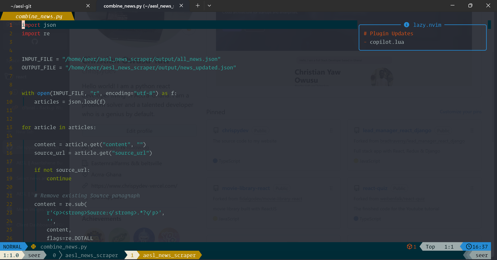

# AESL News Web Scraper

A Python-based web scraping and data processing pipeline developed to collect, filter, clean, and prepare **AESL (Architectural and Engineering Services Limited)** related news articles from online sources.

The system automatically discovers AESL-related news, extracts article information, downloads images, removes irrelevant content, and generates structured JSON data ready for import into a Django-based website.


---

# Overview

Maintaining a company news section manually can be time-consuming. This project automates the entire process by:

- Searching online sources for AESL-related publications
- Scraping article details
- Extracting clean article content
- Downloading article images
- Filtering unrelated news
- Removing duplicate and low-quality articles
- Preparing structured JSON files for CMS/database upload

The main purpose is to maintain an updated and organized news section for the AESL website.

---

# Features

## 🔎 News Discovery

- Automated search for AESL-related news articles
- Supports multiple online sources
- Collects article URLs for processing

## 🕷️ Web Scraping

Extracts:

- Article title
- Article excerpt
- Full article content
- Source URL
- Publication information
- Featured images

## 🧹 Content Filtering

Automatically handles:

- Irrelevant articles
- Duplicate articles
- Poor-quality content
- Articles unrelated to AESL

## 🖼️ Image Processing

- Downloads article images
- Stores images locally
- Links images with generated JSON data

## 📦 Data Preparation

Generates Django-ready JSON files containing:

- Title
- Slug
- Excerpt
- Content
- Source URL
- Tags
- Metadata
- Image paths

---

# Data Pipeline

```
Search Engine
      |
      ↓
News URL Collection
      |
      ↓
Article Scraping
      |
      ↓
Content Extraction
      |
      ↓
Quality Filtering
      |
      ↓
AESL Relevance Filtering
      |
      ↓
Image Downloading
      |
      ↓
JSON Preparation
      |
      ↓
Django Database Import
```

---

# Project Structure

```
aesl-news-scraper/

│
├── news_finder.py
│   └── Searches online sources for AESL-related news
│
├── news_scraper.py
│   └── Extracts article information and downloads images
│
├── filter_quality_aesl_articles.py
│   └── Removes poor-quality and incomplete articles
│
├── filter_final_aesl_articles.py
│   └── Keeps only AESL-related articles
│
├── prepare_aesl_articles.py
│   └── Converts articles into Django-ready format
│
├── combine_news.py
│   └── Combines multiple JSON files into one dataset
│
├── split_aesl_news_articles_b1.py
│   └── Splits large article files into smaller chunks
│
├── split_aesl_new_articles.py
│   └── Splits article collections for processing
│
├── news_sources.json
│   └── Stores search source configuration
│
├── output/
│
│   ├── images/
│   │   └── Downloaded article images
│   │
│   ├── all_news.json
│   │   └── Raw scraped articles
│   │
│   ├── articles.json
│   │   └── Scraped article collection
│   │
│   ├── final_aesl_articles.json
│   │   └── Filtered AESL articles
│   │
│   ├── aesl_ready_articles.json
│   │   └── Final Django import format
│
├── requirements.txt
│
├── README.md
│
└── .gitignore
```

---

# Example Output

The scraper generates structured JSON:

```json
{
    "title": "AESL Appointed Consultants for GFA Technical Centre Accommodation Project",

    "excerpt": "The Ghana Football Association has appointed Architectural and Engineering Services Limited...",

    "content": "<p>The Ghana Football Association (GFA) has appointed AESL...</p>",

    "source_url": "https://example.com/article",

    "image": "output/images/article_1.jpg"
}
```

---

# Installation

## Clone Repository

```bash
git clone https://github.com/chrispydev/aesl-news-scraper.git
```

Navigate into the project:

```bash
cd aesl-news-scraper
```

---

## Create Virtual Environment

```bash
python -m venv venv
```

Activate environment:

### Linux / macOS

```bash
source venv/bin/activate
```

### Windows

```bash
venv\Scripts\activate
```

---

## Install Dependencies

```bash
pip install -r requirements.txt
```

---

# Usage

## 1. Find AESL News

Run:

```bash
python news_finder.py
```

This searches online sources and collects possible AESL-related articles.

---

## 2. Scrape Articles

Run:

```bash
python news_scraper.py
```

The scraper extracts:

- Titles
- Content
- Source URLs
- Images
- Metadata

Generated files are stored inside:

```
output/
```

---

## 3. Filter Articles

Remove irrelevant articles:

```bash
python filter_quality_aesl_articles.py
```

Filter AESL-specific content:

```bash
python filter_final_aesl_articles.py
```

---

## 4. Prepare Django Data

Run:

```bash
python prepare_aesl_articles.py
```

This creates:

```
output/aesl_ready_articles.json
```

which can be imported directly into Django.

---

# Django Integration

The generated JSON is designed for the AESL Django website.

The workflow:

```
Scraper
   |
   ↓
JSON Preparation
   |
   ↓
Image Upload
   |
   ↓
Django Management Command
   |
   ↓
NewsArticle Database
```

Example import:

```bash
python manage.py import_news --file output/aesl_ready_articles.json
```

---

# Technologies Used

- Python
- BeautifulSoup
- Requests
- Selenium / Playwright
- Pillow
- JSON Processing
- Regular Expressions
- Django Integration

---

# Challenges Solved

This project solves:

✅ Finding AESL-related news automatically  
✅ Extracting content from different website structures  
✅ Cleaning scraped HTML/text content  
✅ Filtering unrelated search results  
✅ Handling missing images  
✅ Preventing duplicate articles  
✅ Preparing data for CMS/database import  

---

# Future Improvements

Possible improvements:

- Scheduled automatic scraping using cron jobs
- More supported news sources
- AI-powered article classification
- Semantic duplicate detection
- Direct Django API synchronization
- Background scraping service

---

# Author

**Christian Yaw Owusu**

Software Developer | Web Developer

---

# License

This project is developed for internal AESL website development and content management purposes.
